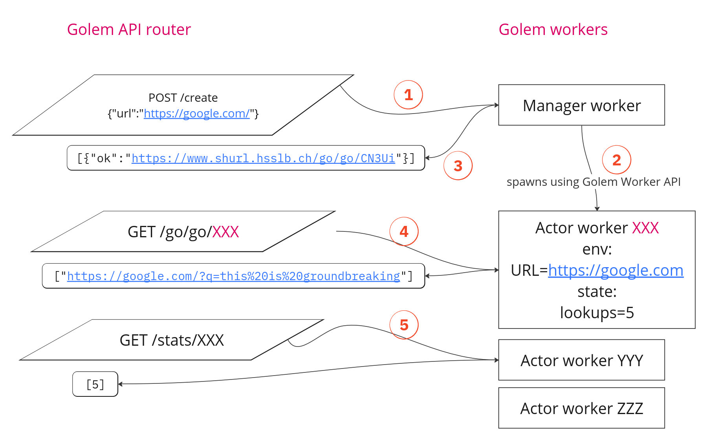

# Naturally scaling URL shortener

URL shortener is a simple product.
But in order to make it work, you need to have a database, a web server, and a lot of other things.

In Golem Cloud, it is possible to treat a single URL as a single actor that
can manage its own state and serve requests.

### Data flow



1. User POSTs an URL to be shortened:
   ```bash
    curl -k -d '{"url":"https://google.com/?q=this%20is%20groundbreaking"}' https://www.shurl.hsslb.ch/create
    #> [{"ok":"https://www.shurl.hsslb.ch/go/go/CN3Ui"}]
   ```
   The request goes to a manager worker (it is unique).
2. The manager worker spawns an actor worker with the URL as an environment variable.
3. The name of the actor is used as part of short URL that is given back to user.
4. When user GETs the short URL, Golem Cloud routes the request to the specific actor worker
   that holds the long URL and also manages the state (lookup counter).
   
   So the actor increments lookup counter, and responds with the long URL.
5. Another route can be used with the actor to get the lookup counter.


### Comment

This approach could be applied to more interesting complex thing in the same manner.

For example, a single actor could be used to manage a single user's profile,
which could also be a gateway to rest of the system.

Or a single actor could represent a temporary signalling session for WebRTC.
So there will be no need to have a signalling server that should manage all the states of all the sessions.
After the session is over, the actor can be disposed.


# Deployment

## Deploy actor template

Checkout [actor/Makefile](actor/Makefile)

## Deploy manager

Manager should be deployed with Golem cloud API token, and the template id of the actor.
Checkout [manager/Makefile](manager/Makefile).

### Building URL manager

At first, put template id of URL actor and API token into main.go, because I couldn't make environment variables work:
```
func init() {
    shortener_manager.SetExportsGolemShortenerManagerApi(&manager.ManagerImpl{
        WorkerTemplateID: "xxxx",
        APIToken:         "zzzz",
```

Then, run


### Deploy

```bash
make wasm embed deploy-template update-test-worker
```

If `manager/wit/main.wit` is changed, you need to run `make bindings` to update the bindings,
but make sure imports are commented out during generation - could not make this work better.
